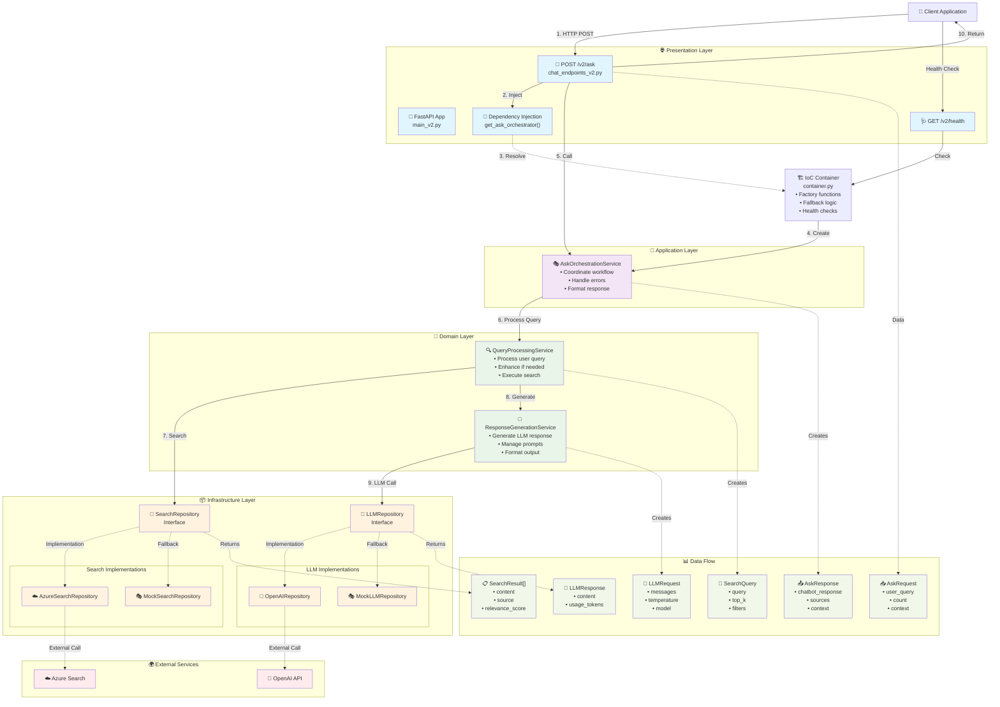
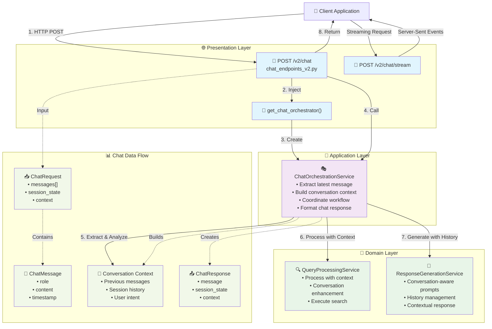
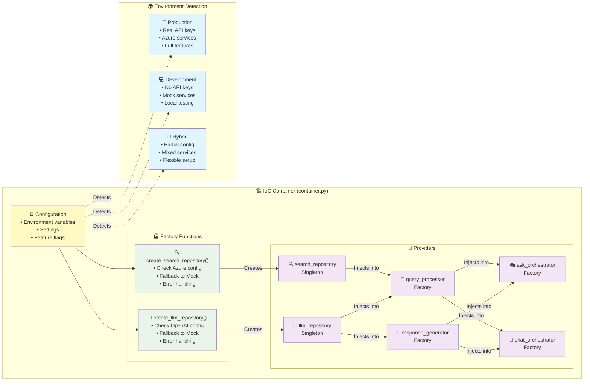

# End-to-End Workflow Diagram: Clean Architecture V2

## 🏗️ Architecture Overview

```
┌─────────────────────────────────────────────────────────────────────────────┐
│                        🌐 PRESENTATION LAYER                                │
│                         (FastAPI Endpoints)                                 │
└─────────────────────────────────────────────────────────────────────────────┘
                                      │
                                      ▼
┌─────────────────────────────────────────────────────────────────────────────┐
│                      🎼 APPLICATION LAYER                                   │
│                    (Orchestration Services)                                 │
└─────────────────────────────────────────────────────────────────────────────┘
                                      │
                                      ▼
┌─────────────────────────────────────────────────────────────────────────────┐
│                        🧠 DOMAIN LAYER                                      │
│                      (Domain Services)                                      │
└─────────────────────────────────────────────────────────────────────────────┘
                                      │
                                      ▼
┌─────────────────────────────────────────────────────────────────────────────┐
│                     📦 INFRASTRUCTURE LAYER                                │
│                        (Repositories)                                       │
└─────────────────────────────────────────────────────────────────────────────┘
```

## 🔄 Complete Ask Workflow



## 🔄 Complete Chat Workflow



## 🏗️ Dependency Injection Container Flow



## 🔧 Component Interaction Matrix

| Component | Layer | Depends On | Provides To | Responsibility |
|-----------|-------|------------|-------------|----------------|
| **FastAPI Endpoints** | 🌐 Presentation | Orchestration Services | HTTP Clients | HTTP handling, validation |
| **AskOrchestrationService** | 🎼 Application | Domain Services | Ask Endpoint | Ask workflow coordination |
| **ChatOrchestrationService** | 🎼 Application | Domain Services | Chat Endpoint | Chat workflow coordination |
| **QueryProcessingService** | 🧠 Domain | Repositories | Orchestration Services | Query analysis & search |
| **ResponseGenerationService** | 🧠 Domain | LLM Repository | Orchestration Services | Response generation |
| **SearchRepository** | 📦 Infrastructure | External APIs | Domain Services | Search abstraction |
| **LLMRepository** | 📦 Infrastructure | External APIs | Domain Services | LLM abstraction |
| **IoC Container** | 🏗️ Core | Configuration | All Services | Dependency management |

## 🚀 Request Flow Sequence

### Ask Request Flow:
```
1. Client → POST /v2/ask
2. FastAPI → get_ask_orchestrator() [DI]
3. Container → Creates AskOrchestrationService
4. AskOrchestrationService → process_ask_request()
5. QueryProcessingService → process_user_query()
6. SearchRepository → search(query)
7. External Service → Azure Search / Mock
8. ResponseGenerationService → generate_contextual_response()
9. LLMRepository → generate_response()
10. External Service → OpenAI / Mock
11. AskOrchestrationService → Build AskResponse
12. FastAPI → Return JSON response
13. Client → Receive response
```

### Chat Request Flow:
```
1. Client → POST /v2/chat
2. FastAPI → get_chat_orchestrator() [DI]
3. Container → Creates ChatOrchestrationService
4. ChatOrchestrationService → process_chat_request()
5. Extract latest message + build conversation context
6. QueryProcessingService → process_user_query(with_context)
7. SearchRepository → search(enhanced_query)
8. ResponseGenerationService → generate_contextual_response(with_history)
9. LLMRepository → generate_response(with_conversation)
10. ChatOrchestrationService → Build ChatResponse
11. FastAPI → Return JSON response
12. Client → Receive response
```

## 🎯 Key Benefits of This Architecture

### 🧪 **Testability**
- **Easy Mocking**: Each layer can be tested independently
- **Dependency Injection**: No global state to manage
- **Clear Contracts**: Interfaces define exact behavior

### 🔧 **Maintainability**
- **Single Responsibility**: Each component has one clear purpose
- **Loose Coupling**: Components depend on abstractions, not implementations
- **Clear Boundaries**: Layers have well-defined responsibilities

### 🚀 **Production Readiness**
- **Smart Fallbacks**: Graceful degradation with mock services
- **Health Monitoring**: Built-in health checks at every layer
- **Error Handling**: Centralized error management

### 📈 **Scalability**
- **Repository Pattern**: Easy to swap implementations
- **Service Layer**: Business logic isolated from infrastructure
- **Dependency Injection**: Runtime composition of services

This architecture completely replaces the old approaches pattern with a much more robust, testable, and maintainable solution! 