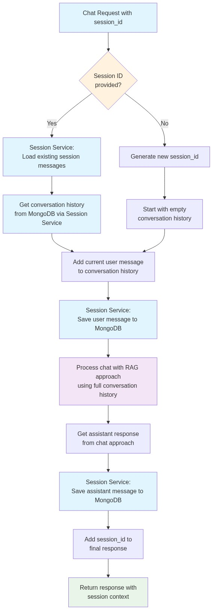
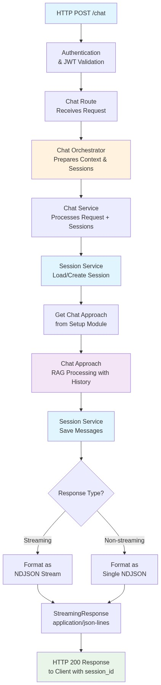
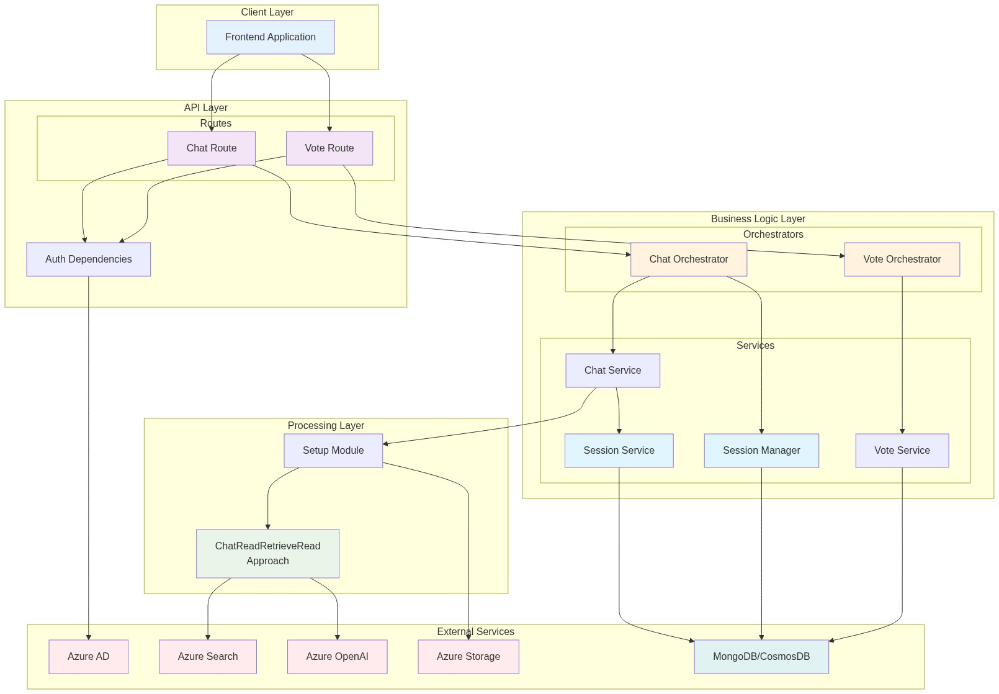
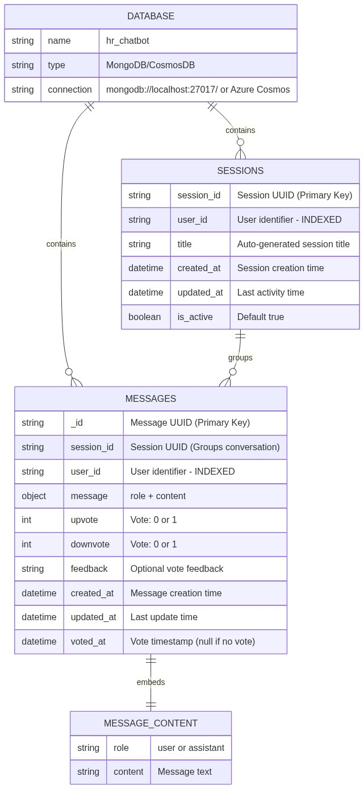
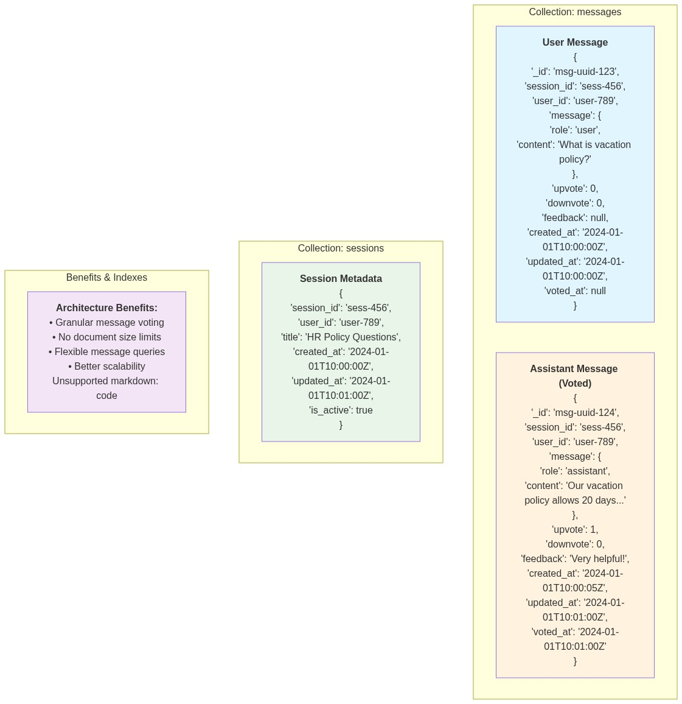

# FastAPI Chat Application - Message-Per-Document Architecture

This document provides comprehensive architectural diagrams and documentation for the FastAPI-based HR Chatbot application using a **message-per-document** data model.

## Architecture Diagrams

### 3. Simplified Sessions Flow in Chat


**Purpose**: Shows how session management works with message-per-document storage.

**Key Components**:
- User initiates chat request
- System checks for existing session or creates new one
- Each message is stored as a separate document
- Session metadata tracks conversation state

### 4. Simplified Chat Flow  


**Purpose**: High-level overview of the chat processing pipeline.

**Flow**:
1. User sends message via Chat Route
2. Message Service saves user message as document
3. Chat Service processes with AI using conversation history
4. Assistant response saved as separate message document
5. Response streamed back with message IDs

### 5. System Architecture Overview


**Purpose**: Complete system architecture showing all components and their relationships.

**Architecture Layers**:
- **Client Layer**: Frontend applications
- **API Layer**: FastAPI routes (Chat, Vote)
- **Business Logic**: Message Service, Vote Service
- **Processing Layer**: Azure OpenAI, Azure Search
- **Data Layer**: MongoDB/CosmosDB with message documents

## Message-Per-Document Database Schema

### 6. Database Schema


**Purpose**: Shows the message-per-document database structure with separate collections.

**Schema Details**:
- **Database**: `hr_chatbot` (MongoDB/CosmosDB)
- **Collections**: `messages` (individual messages), `sessions` (conversation metadata)
- **Document Structure**: Each message is a separate document with vote fields

### 7. Document Examples


**Purpose**: Shows actual document structure for messages and sessions.

## Message-Per-Document Architecture

The application uses a **message-per-document approach** where each chat message and vote is stored as an individual document:

### Message Document Structure
```json
{
  "_id": "msg-uuid-123",
  "session_id": "sess-456", 
  "user_id": "user-789",
  "message": {
    "role": "user",
    "content": "What is the vacation policy?"
  },
  "upvote": 0,
  "downvote": 0,
  "feedback": null,
  "created_at": "2024-01-01T10:00:00Z",
  "updated_at": "2024-01-01T10:00:00Z",
  "voted_at": null
}
```

### Session Document Structure
```json
{
  "session_id": "sess-456",
  "user_id": "user-789",
  "title": "HR Policy Questions",
  "created_at": "2024-01-01T10:00:00Z",
  "updated_at": "2024-01-01T10:01:00Z",
  "is_active": true
}
```

### Key Fields
- **`_id`**: Message UUID (MongoDB document ID)
- **`session_id`**: Groups messages into conversations
- **`user_id`**: User identifier (indexed for security)
- **`message`**: Nested object with `role` and `content`
- **`upvote`/`downvote`**: Vote values (0 or 1)
- **`feedback`**: Optional vote feedback text
- **`voted_at`**: Timestamp when vote was cast (null if no vote)

### Validation Rules
- `upvote` and `downvote` must be 0 or 1
- Both cannot be 1 simultaneously
- `role` must be "user" or "assistant"
- `feedback` is optional string
- `voted_at` is null until user votes

### Database Indexes
```javascript
// Messages collection indexes
db.messages.createIndex({"_id": 1})                    // Primary key
db.messages.createIndex({"user_id": 1})                // Security
db.messages.createIndex({"session_id": 1})             // Conversation grouping
db.messages.createIndex({"voted_at": 1})               // Vote queries
db.messages.createIndex({"user_id": 1, "session_id": 1}) // Compound for conversations
db.messages.createIndex({"created_at": 1})             // Chronological ordering

// Sessions collection indexes  
db.sessions.createIndex({"session_id": 1})             // Primary key
db.sessions.createIndex({"user_id": 1})                // Security
db.sessions.createIndex({"updated_at": 1})             // Recent activity
db.sessions.createIndex({"user_id": 1, "is_active": 1}) // Active sessions
```

### Architecture Benefits
1. **Granular Voting**: Vote on individual messages, not entire conversations
2. **No Size Limits**: No document size constraints from embedded arrays
3. **Flexible Queries**: Easy to filter/search individual messages
4. **Better Scalability**: Each message is independent
5. **Analytics Friendly**: Better for message-level analytics
6. **Atomic Operations**: Each message/vote update is atomic

## API Endpoints

### Chat Endpoints
- `POST /chat` - Send chat message and get AI response
- `GET /sessions` - List user sessions
- `GET /sessions/{session_id}/messages` - Get conversation history

### Vote Endpoints  
- `POST /vote` - Vote on a specific message
- `GET /votes` - Get messages with votes
- `DELETE /vote/{message_id}` - Remove vote from message
- `GET /message/{message_id}` - Get message with vote info

### Chat Request Format
```json
{
  "messages": [
    {
      "role": "user",
      "content": "What is the vacation policy?"
    }
  ],
  "session_id": "sess-456",  // Optional - creates new if not provided
  "stream": true
}
```

### Vote Request Format
```json
{
  "message_id": "msg-uuid-124",
  "session_id": "sess-456",
  "upvote": 1,
  "downvote": 0,
  "feedback": "Very helpful explanation!"
}
```

## Workflow

### Chat Flow
1. **User Message**: POST to `/chat` with message content
2. **Session Handling**: 
   - If `session_id` provided, verify access
   - If not provided, create new session
3. **Message Storage**: Save user message as document with generated UUID
4. **Context Loading**: Load conversation history from message documents
5. **AI Processing**: Process with Azure OpenAI using conversation context
6. **Response Storage**: Save assistant response as separate message document
7. **Streaming Response**: Return NDJSON with session_id and message_ids

### Vote Flow
1. **Vote Request**: POST to `/vote` with message_id, session_id, vote data
2. **Message Verification**: Verify message exists and belongs to user/session
3. **Vote Update**: Update message document with vote fields atomically
4. **Response**: Return updated message with vote information

## Technical Implementation

### Authentication
- **Azure AD Integration**: JWT token validation
- **User Isolation**: All data partitioned by `user_id`
- **Security**: RequireAuth dependency on all endpoints

### AI Integration
- **Azure OpenAI**: GPT models for chat completion
- **Azure Search**: RAG (Retrieval Augmented Generation)
- **Streaming**: NDJSON response format for real-time chat

### Message Management
- **Document Storage**: Each message is a separate MongoDB document
- **Session Grouping**: Messages linked by `session_id`
- **Vote Integration**: Vote data stored within each message document
- **Context Preservation**: Conversation history loaded from message documents

### Error Handling
- Comprehensive validation with Pydantic models
- User-friendly error messages
- Proper HTTP status codes
- Logging for debugging and monitoring

## Development and Testing

### Running Tests
```bash
# Run all tests
pytest

# Run message architecture tests  
pytest tests/test_message_architecture.py

# Run with coverage
pytest --cov=app tests/
```

### Local Development
```bash
# Install dependencies
pip install -r requirements.txt

# Set environment variables
export AZURE_OPENAI_ENDPOINT="your-endpoint"
export AZURE_SEARCH_ENDPOINT="your-search-endpoint"

# Run development server
uvicorn app.main:app --reload
```

### Database Connection
```python
# Local MongoDB
MONGODB_CONNECTION_STRING="mongodb://localhost:27017/"

# Azure Cosmos DB
COSMOS_CONNECTION_STRING="your-cosmos-connection-string"
```

## Performance Considerations

### Advantages
- **Scalability**: No document size limits from embedded arrays
- **Flexibility**: Easy to query individual messages
- **Atomic Updates**: Each vote update is atomic
- **Indexing**: Better indexing options for different query patterns

### Query Patterns
```javascript
// Get conversation messages (most common)
db.messages.find({
  "user_id": "user-789",
  "session_id": "sess-456"
}).sort({"created_at": 1})

// Get voted messages
db.messages.find({
  "user_id": "user-789", 
  "voted_at": {"$ne": null}
}).sort({"voted_at": -1})

// Get recent user sessions
db.sessions.find({
  "user_id": "user-789",
  "is_active": true
}).sort({"updated_at": -1})
```

This message-per-document architecture provides excellent scalability and flexibility for the HR chatbot, enabling granular voting on individual messages while maintaining clean separation between conversation metadata and message content. 