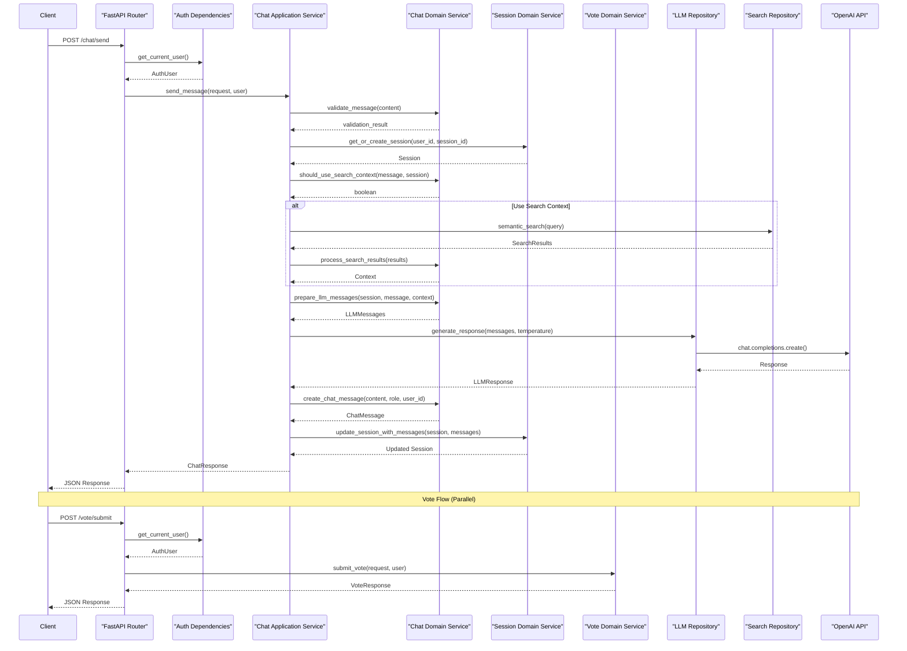

# Simplified Clean Architecture API

A FastAPI application implementing **simplified clean architecture** with **chat** and **voting** functionality.

## 🏗️ Architecture Overview

This project follows a **decoupled clean architecture** with clear separation of concerns:

## 🔄 Complete Request Flow

Here's the detailed flow from client request to response:



**Flow Characteristics:**
- **8 components** involved in main chat flow
- **Clear separation** between Application (coordination) and Domain (business logic)
- **Direct service instantiation** (no dependency injection container)
- **Parallel vote flow** showing decoupled services
- **Moderate complexity** with good separation of concerns

```
┌─────────────────────────────────────────┐
│               API Layer                 │
│  ┌─────────────────┐ ┌─────────────────┐│
│  │ Chat Endpoints  │ │ Vote Endpoints  ││
│  └─────────────────┘ └─────────────────┘│
└─────────────────────────────────────────┘
                    │
┌─────────────────────────────────────────┐
│            Auth Gateway                 │
│        FastAPI Dependencies            │
└─────────────────────────────────────────┘
                    │
┌─────────────────────────────────────────┐
│          Application Layer              │
│  ┌─────────────────┐ ┌─────────────────┐│
│  │ Chat App Service│ │ Vote App Service││
│  └─────────────────┘ └─────────────────┘│
└─────────────────────────────────────────┘
                    │
┌─────────────────────────────────────────┐
│            Domain Layer                 │
│ ┌─────────┐ ┌─────────┐ ┌──────────────┐│
│ │ Chat    │ │ Vote    │ │ Session      ││
│ │ Domain  │ │ Domain  │ │ Domain       ││
│ └─────────┘ └─────────┘ └──────────────┘│
└─────────────────────────────────────────┘
                    │
┌─────────────────────────────────────────┐
│          Repository Layer               │
│  ┌─────────────────┐ ┌─────────────────┐│
│  │ LLM Repository  │ │Search Repository││
│  └─────────────────┘ └─────────────────┘│
└─────────────────────────────────────────┘
```

## 📁 Project Structure

```
simplified_clean_architecture_v2/
├── main.py                          # FastAPI application entry point
├── requirements.txt                 # Python dependencies
├── README.md                       # This file
├── .env.example                    # Environment variables template
└── app/
    ├── __init__.py
    ├── api/                        # 🌐 API Layer
    │   ├── __init__.py
    │   └── endpoints/
    │       ├── __init__.py
    │       ├── chat_endpoints.py   # Chat HTTP endpoints
    │       └── vote_endpoints.py   # Vote HTTP endpoints
    ├── auth/                       # 🔐 Auth Gateway
    │   ├── __init__.py
    │   └── dependencies.py         # FastAPI auth dependencies
    ├── services/                   # 📋 Services Layer
    │   ├── __init__.py
    │   ├── application/            # Application Services (Coordination)
    │   │   ├── __init__.py
    │   │   ├── chat_application_service.py
    │   │   └── vote_application_service.py
    │   └── domain/                 # Domain Services (Business Logic)
    │       ├── __init__.py
    │       ├── chat_domain_service.py
    │       ├── vote_domain_service.py
    │       └── session_domain_service.py
    └── repositories/               # 💾 Repository Layer
        ├── __init__.py
        ├── llm_repository.py       # LLM provider abstraction
        └── search_repository.py    # Search/vector DB abstraction
```

## 🎯 Key Architecture Principles

### ✅ **Benefits**
- **Clear Separation**: Each layer has a single responsibility
- **Business Logic Isolation**: Domain services contain pure business rules
- **Testability**: Easy to mock repositories and services
- **Maintainability**: Changes in one layer don't affect others
- **Scalability**: Easy to add new features following the same pattern

### 🔄 **Flow**
1. **HTTP Request** → **API Endpoints**
2. **Endpoints** → **Auth Dependencies** (authentication)
3. **Auth Gateway** → **Application Services** (workflow coordination)
4. **Application Services** → **Domain Services** (business logic)
5. **Domain Services** → **Repositories** (data access)

## 🚀 Getting Started

### 1. **Installation**

```bash
# Clone or create the project
cd simplified_clean_architecture_v2

# Create virtual environment
python -m venv venv
source venv/bin/activate  # On Windows: venv\Scripts\activate

# Install dependencies
pip install -r requirements.txt
```

### 2. **Environment Setup**

Create `.env` file:
```bash
# JWT Configuration
JWT_SECRET=your-super-secret-key-change-in-production

# OpenAI Configuration (optional)
OPENAI_API_KEY=your-openai-api-key
OPENAI_MODEL=gpt-3.5-turbo

# Search Configuration (optional)
SEARCH_ENDPOINT=your-search-endpoint
VECTOR_DB_URL=your-vector-db-url
```

### 3. **Run the Application**

```bash
# Start the server
python main.py

# Or use uvicorn directly
uvicorn main:app --reload --host 0.0.0.0 --port 8000
```

### 4. **Access the API**

- **API Documentation**: http://localhost:8000/docs
- **Health Check**: http://localhost:8000/health
- **Chat Endpoints**: http://localhost:8000/chat/*
- **Vote Endpoints**: http://localhost:8000/vote/*

## 📚 API Examples

### **Authentication**
All endpoints require JWT authentication:
```bash
# Get token (implement login endpoint)
TOKEN="your-jwt-token"

# Use in requests
curl -H "Authorization: Bearer $TOKEN" http://localhost:8000/chat/sessions
```

### **Chat API**
```bash
# Send a chat message
curl -X POST "http://localhost:8000/chat/message" \
  -H "Authorization: Bearer $TOKEN" \
  -H "Content-Type: application/json" \
  -d '{"message": "Hello, how are you?", "use_search": true}'

# Get chat sessions
curl -H "Authorization: Bearer $TOKEN" \
  http://localhost:8000/chat/sessions
```

### **Vote API**
```bash
# Submit a vote
curl -X POST "http://localhost:8000/vote/submit" \
  -H "Authorization: Bearer $TOKEN" \
  -H "Content-Type: application/json" \
  -d '{
    "message_id": "msg-123", 
    "session_id": "session-456", 
    "vote_type": "thumbs_up",
    "feedback": "Great response!"
  }'

# Get vote summary
curl -H "Authorization: Bearer $TOKEN" \
  http://localhost:8000/vote/message/msg-123/summary
```

## 🧪 Testing

```bash
# Run tests (if implemented)
pytest

# Test with different environments
pytest --env=test
```

## 📦 Layer Details

### **🌐 API Layer**
- **Purpose**: Handle HTTP requests/responses
- **Responsibilities**: Request validation, response formatting, error handling
- **Files**: `chat_endpoints.py`, `vote_endpoints.py`

### **🔐 Auth Gateway**
- **Purpose**: Authentication and authorization
- **Responsibilities**: JWT validation, user extraction
- **Files**: `dependencies.py`

### **📋 Application Layer**
- **Purpose**: Coordinate workflows between domain and repositories
- **Responsibilities**: DTO handling, orchestration, transaction coordination
- **Files**: `chat_application_service.py`, `vote_application_service.py`

### **🧠 Domain Layer**
- **Purpose**: Pure business logic
- **Responsibilities**: Business rules, validation, domain models
- **Files**: `chat_domain_service.py`, `vote_domain_service.py`, `session_domain_service.py`

### **💾 Repository Layer**
- **Purpose**: Data access abstraction
- **Responsibilities**: External API calls, database operations
- **Files**: `llm_repository.py`, `search_repository.py`

## 🔧 Configuration

The application uses environment variables for configuration:

- **JWT_SECRET**: Secret key for JWT tokens
- **OPENAI_API_KEY**: OpenAI API key (optional, uses mocks if not provided)
- **SEARCH_ENDPOINT**: Search service endpoint (optional)
- **VECTOR_DB_URL**: Vector database URL (optional)

## 🛡️ Security

- **JWT Authentication**: All endpoints protected with JWT tokens
- **User Isolation**: Users can only access their own data
- **Input Validation**: Request validation at API and domain levels
- **Error Handling**: Secure error responses without sensitive information

## 🔍 Monitoring

- **Health Checks**: `/health` endpoint for service monitoring
- **Logging**: Structured logging with loguru
- **Error Tracking**: Comprehensive error handling and logging

## 📈 Extending the Architecture

### **Adding New Features**
1. **Create Domain Service** with business logic
2. **Create Application Service** for coordination
3. **Create API Endpoints** for HTTP handling
4. **Add Repository** if external data access needed

### **Example: Adding User Management**
```
app/services/domain/user_domain_service.py      # Business logic
app/services/application/user_application_service.py  # Coordination
app/api/endpoints/user_endpoints.py             # HTTP endpoints
app/repositories/user_repository.py             # Data access (if needed)
```

## 🤝 Contributing

1. Follow the established architecture patterns
2. Keep domain services pure (no external dependencies)
3. Use application services for coordination
4. Add comprehensive tests for new features
5. Update documentation

## 📄 License

This project is a template/example implementation. Adapt as needed for your use case. 