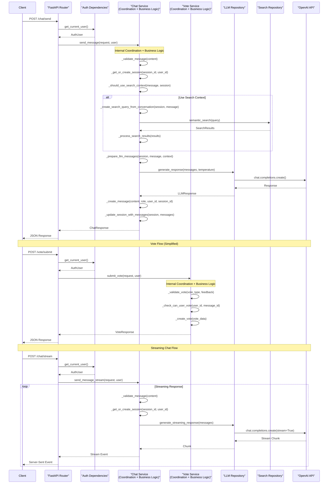

# Single Service Layer Architecture

The **simplest possible clean architecture** for a FastAPI AI Chat API. This approach combines both coordination and business logic into a single service layer, eliminating the complexity of separate Application and Domain layers while still maintaining clean separation of concerns.

## 🏗️ Architecture Overview

This is the **ultimate simplified version** with only 4 layers:

## 🔄 Complete Request Flow

Here's the detailed flow from client request to response:



**Flow Characteristics:**
- **5 components** involved in the flow (minimal complexity)
- **Single service** handles both coordination AND business logic
- **Internal method calls** (shown as self-calls) for business rules
- **Minimal external dependencies** and abstractions
- **Streaming support** integrated in the same service
- **Ultimate simplicity** while maintaining clean separation

```
┌─────────────────────────────────────────┐
│             API Layer                   │
│  ┌─────────────────┐ ┌─────────────────┐│
│  │  Chat Endpoints │ │  Vote Endpoints ││
│  │   (HTTP API)    │ │   (HTTP API)    ││
│  └─────────────────┘ └─────────────────┘│
└─────────────────────────────────────────┘
                    │
┌─────────────────────────────────────────┐
│           Auth Gateway                  │
│         (JWT Authentication)            │
└─────────────────────────────────────────┘
                    │
┌─────────────────────────────────────────┐
│          Service Layer                  │
│  ┌─────────────────┐ ┌─────────────────┐│
│  │  Chat Service   │ │  Vote Service   ││
│  │ (Coordination + │ │ (Coordination + ││
│  │Business Logic)  │ │Business Logic)  ││
│  └─────────────────┘ └─────────────────┘│
└─────────────────────────────────────────┘
                    │
┌─────────────────────────────────────────┐
│         Repository Layer                │
│  ┌─────────────────┐ ┌─────────────────┐│
│  │  LLM Repository │ │Search Repository││
│  │   (APIs/Mock)   │ │  (Vector DBs)   ││
│  └─────────────────┘ └─────────────────┘│
└─────────────────────────────────────────┘
```

## 🎯 Key Benefits

### **Maximum Simplicity**
- Only 4 architectural layers (vs 6+ in enterprise patterns)
- Single service classes handle both coordination and business logic
- Minimal abstraction overhead
- Fastest development time

### **Still Clean & Maintainable**
- Clear separation between API, Auth, Services, and Data Access
- Single Responsibility Principle within each service
- Easy to test and understand
- Repository pattern for external dependencies

### **Production Ready**
- Full JWT authentication
- Comprehensive error handling
- Structured logging
- API documentation
- Health checks

## 📁 Project Structure

```
single_service_layer_architecture/
├── main.py                          # FastAPI application entry point
├── requirements.txt                 # Python dependencies
├── README.md                       # This file
├── logs/                           # Application logs
└── app/
    ├── __init__.py
    ├── api/                        # API Layer
    │   ├── __init__.py
    │   └── endpoints/
    │       ├── __init__.py
    │       ├── chat_endpoints.py    # Chat HTTP endpoints
    │       └── vote_endpoints.py    # Vote HTTP endpoints
    ├── auth/                       # Auth Gateway
    │   ├── __init__.py
    │   └── dependencies.py          # JWT authentication
    ├── services/                   # Service Layer (Combined)
    │   ├── __init__.py
    │   ├── chat_service.py         # Chat coordination + business logic
    │   └── vote_service.py         # Vote coordination + business logic
    └── repositories/               # Repository Layer
        ├── __init__.py
        ├── llm_repository.py       # LLM API abstraction
        └── search_repository.py    # Search/Vector DB abstraction
```

## ⚡ Quick Start

### 1. Install Dependencies
```bash
cd single_service_layer_architecture
pip install -r requirements.txt
```

### 2. Set Environment Variables
```bash
# Create .env file
echo "SECRET_KEY=your-secret-key-here" > .env
echo "OPENAI_API_KEY=your-openai-key-here" >> .env  # Optional
```

### 3. Run the Application
```bash
python main.py
```

The API will be available at:
- **API Docs**: http://localhost:8000/docs
- **Health Check**: http://localhost:8000/health
- **Root**: http://localhost:8000/

## 📚 Architecture Details

### **Service Layer Philosophy**

The Service Layer combines what traditionally would be split into Application and Domain layers:

```python
class ChatService:
    """
    Single service handling both coordination and business logic
    Combines what used to be Application Service + Domain Service
    """
    
    # PUBLIC API METHODS (called by endpoints)
    async def send_message(self, request, user):
        # Coordination: orchestrate the workflow
        session = await self._get_or_create_session(...)
        context = await self._get_search_context(...)
        
        # Business logic: apply rules and validation
        self._validate_message(request.message)
        should_search = self._should_use_search_context(...)
        
        # More coordination: call repositories
        response = await self.llm_repository.generate_response(...)
        
        # Business logic: create and validate response
        message = self._create_message(...)
        return response
    
    # PRIVATE METHODS (internal business logic + coordination)
    def _validate_message(self, content): ...
    def _should_use_search_context(self, message): ...
    async def _get_search_context(self, session): ...
```

### **Benefits of This Approach**

1. **Single Point of Truth**: All logic for a feature is in one place
2. **Easier Debugging**: No bouncing between multiple service layers
3. **Faster Development**: Less boilerplate and abstraction
4. **Simpler Testing**: Test one service class instead of multiple
5. **Natural Code Organization**: Public methods for endpoints, private methods for internal logic

### **When to Use This Pattern**

✅ **Perfect for:**
- Small to medium-sized applications
- Teams that value simplicity
- Rapid prototyping and MVP development
- When team prefers pragmatic over theoretical purity
- Single domain applications

❌ **Consider enterprise patterns when:**
- Very large, complex domains
- Multiple teams working on same codebase
- Complex business rule interactions
- Need for extensive domain modeling

## 🔧 API Endpoints

### **Chat Endpoints** (`/chat`)
- `POST /chat/send` - Send a message
- `POST /chat/stream` - Send with streaming response
- `GET /chat/sessions` - Get user sessions
- `GET /chat/sessions/{id}/history` - Get session history
- `DELETE /chat/sessions/{id}` - Delete session

### **Vote Endpoints** (`/vote`)
- `POST /vote/submit` - Submit a vote
- `PUT /vote/{id}` - Update a vote
- `GET /vote/messages/{id}/summary` - Get vote summary
- `GET /vote/my-votes` - Get user's votes
- `GET /vote/sessions/{id}` - Get session votes
- `DELETE /vote/{id}` - Delete vote
- `GET /vote/analytics` - Get voting analytics

## 🛡️ Security

- **JWT Authentication**: Secure token-based auth
- **User Isolation**: Users can only access their own data
- **Input Validation**: Comprehensive request validation
- **Rate Limiting**: Can be easily added to endpoints
- **CORS Configuration**: Properly configured for web clients

## 📝 Development

### **Adding New Features**

1. **Create Service Method**: Add business logic to appropriate service
2. **Create Endpoint**: Add HTTP endpoint that calls service
3. **Add Models**: Create Pydantic models for request/response
4. **Test**: Write tests for both service and endpoint

### **Testing**

```python
# Test the service directly
async def test_chat_service():
    service = ChatService()
    response = await service.send_message(request, user)
    assert response.message is not None

# Test the endpoint
async def test_chat_endpoint():
    response = client.post("/chat/send", json={"message": "Hello"})
    assert response.status_code == 200
```

## 🚀 Deployment

This architecture is perfect for:
- **Docker containers**
- **Serverless functions** (with minor modifications)
- **Traditional VPS/servers**
- **Cloud platforms** (AWS, GCP, Azure)

## 🔄 Evolution Path

As your application grows, you can easily:

1. **Split services** when they become too large
2. **Add caching layer** between services and repositories  
3. **Extract domain models** if business logic becomes complex
4. **Add event-driven patterns** for decoupling
5. **Migrate to microservices** by extracting services

## 🤔 Architecture Comparison

| Aspect | Single Service Layer | Traditional Clean Architecture |
|--------|---------------------|--------------------------------|
| **Layers** | 4 | 6+ |
| **Complexity** | Minimal | High |
| **Development Speed** | Fastest | Slower |
| **Learning Curve** | Easy | Steep |
| **Maintenance** | Simple | Complex |
| **Testability** | Good | Excellent |
| **Flexibility** | Good | Excellent |
| **Over-engineering Risk** | Low | High |

## 💡 Key Insights

This architecture proves that **clean code doesn't require complex patterns**. By combining coordination and business logic in a single service layer, we get:

- 🎯 **90% of the benefits** of clean architecture
- 🚀 **50% of the complexity** of enterprise patterns  
- ⚡ **Fastest time-to-market** for most applications
- 🧠 **Easiest to understand** for new team members

**The best architecture is the simplest one that solves your problem.**

---

*This architecture represents the sweet spot between simplicity and maintainability for most real-world applications.* 